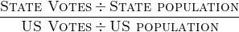

# Electorally Mapped
*Mapping Electoral College Strength by State*

Demo: [Heroku Deployment](https://electorally-mapped.herokuapp.com/)

## Overview
The purpose of this application is to visualize the changing nature of the Electoral College over time. A strength score is calculated for each state based on the amount of power the citizen of a given state has relative to a perfectly proportional voter. 

The user can see the changing distribution of electoral power over time with a heatmap of the United States.

## Specifications

The application is built using **React**. Data visualizations are custom **d3**. Census and Electoral College data are stored in csv files and processed by d3. **TopoJSON** is provided by [pre-built TopoJSON](https://github.com/topojson/us-atlas) from the US Census Bureau. 

Population data for each state is provided by the US Census ([Pre-1990](https://www.census.gov/population/www/censusdata/pop1790-1990.html), [Post-1990](https://www.census.gov/programs-surveys/popest/data/tables.html)) and the electoral college data is from the [National Archives](https://www.archives.gov/federal-register/electoral-college/votes/votes_by_state.html).

## Methodology
The strength score is calculated from the following equation:

If a state's electoral votes divided by the state's population are equal in proportion to the total electoral votes in the US divided by the US population, then the score is 1. 

The electoral college numbers are taken from each presidential election when they were counted. State population numbers are derived
 

